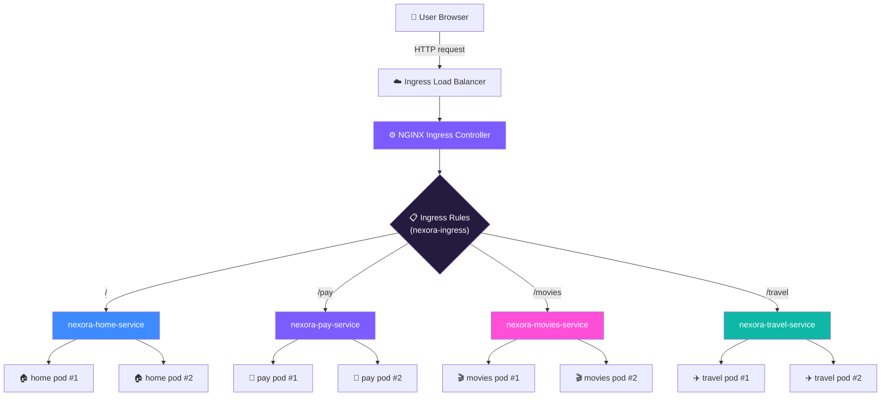
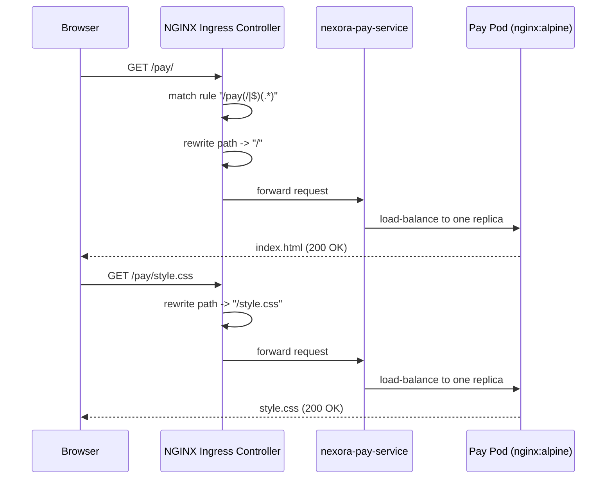

# NEXORA — Multi-App Docker + Kubernetes + NGINX Ingress Demo

**Everything You Need. One Digital World.**

NEXORA is a demo digital-services ecosystem built to teach and demonstrate Docker
containerization, independent Kubernetes microservices, and NGINX Ingress
path-based routing. It ships three visually distinct, fully static frontend
applications — **Nexora Pay** (fintech), **Nexora Movies** (cinematic ticket
booking) and **Nexora Travel** (travel booking) — plus a landing portal that
ties them together, all running as independent pods behind a single Ingress.

> Design note: all UI, copy, icons and "brand" assets in this project are
> original and created for this demo. Visual inspiration was drawn loosely
> from the *category* of modern Indian fintech/OTT/travel apps, but no logos,
> trademarks, copyrighted images or exact layouts from any real company are
> used anywhere in this repository.

---

## Table of Contents

1. [Project Architecture](#1-project-architecture)
2. [Folder Structure](#2-folder-structure)
3. [Application Overview](#3-application-overview)
4. [Docker Build Process](#4-docker-build-process)
5. [Docker Push Process](#5-docker-push-process)
6. [Kubernetes Deployment](#6-kubernetes-deployment)
7. [Installing the NGINX Ingress Controller](#7-installing-the-nginx-ingress-controller)
8. [Ingress Configuration](#8-ingress-configuration)
9. [How Routing Works](#9-how-routing-works)
10. [Finding the Ingress IP / Hostname](#10-finding-the-ingress-ip--hostname)
11. [Testing Every Route](#11-testing-every-route)
12. [Kubernetes Verification Commands](#12-kubernetes-verification-commands)
13. [Troubleshooting](#13-troubleshooting)
14. [Cleanup Commands](#14-cleanup-commands)

---

## 0. Quick Local Preview (no Docker/Kubernetes required)

Just want to look at the four apps first? Unzip the project and **double-click
`landing/index.html`** — it opens straight in your browser. Clicking any of
the three cards (or the top-nav links) takes you to the matching app's
`index.html` in the sibling folder. Each app also detects this "opened as a
local file" mode automatically and points its logo back to the landing page.

> This local-file mode and the Kubernetes-served mode use different link
> styles under the hood (relative folder links vs. Ingress path routing at
> `/pay`, `/movies`, `/travel`) — a small script in each page's `script.js`
> detects which mode it's running in and rewrites the links accordingly, so
> the same HTML works unmodified in both places.

---

## 1. Project Architecture



Each application is:

- Built as its **own Docker image** (`nginx:alpine` + static files).
- Deployed as its **own Kubernetes Deployment** with **2 replicas**.
- Exposed via its **own ClusterIP Service**.
- Routed to by **one shared Ingress resource** using URL path prefixes.

This mirrors a real microservice-per-team setup: each app can be built,
scaled, updated and rolled back completely independently, while still
appearing to end users as a single unified website.

---

## 2. Folder Structure

```text
nexora-ingress-demo/
├── app1/                     # NEXORA PAY   -> served at /pay
│   ├── index.html
│   ├── style.css
│   ├── script.js
│   └── Dockerfile
├── app2/                     # NEXORA MOVIES -> served at /movies
│   ├── index.html
│   ├── style.css
│   ├── script.js
│   └── Dockerfile
├── app3/                     # NEXORA TRAVEL -> served at /travel
│   ├── index.html
│   ├── style.css
│   ├── script.js
│   └── Dockerfile
├── landing/                  # NEXORA HOME (main portal) -> served at /
│   ├── index.html
│   ├── style.css
│   ├── script.js
│   └── Dockerfile
├── k8s/
│   ├── namespace.yaml        # creates the "nexora" namespace
│   ├── app1-deploy.yaml      # Nexora Pay      Deployment + Service
│   ├── app2-deploy.yaml      # Nexora Movies   Deployment + Service
│   ├── app3-deploy.yaml      # Nexora Travel   Deployment + Service
│   ├── landing-deploy.yaml   # Nexora Home     Deployment + Service
│   ├── ingress.yaml          # PRIMARY: path-based Ingress (/, /pay, /movies, /travel)
│   └── ingress-hosts.yaml    # OPTIONAL: host-based Ingress (*.nexora.local)
└── README.md
```

> This project intentionally combines each app's `Deployment` and `Service`
> into a single `*-deploy.yaml` file (separated by `---`) to keep the `k8s/`
> folder easy to read end-to-end. They behave identically to separate files
> when applied with `kubectl apply -f k8s/`.

---

## 3. Application Overview

| App | Route | Theme | Purpose |
|---|---|---|---|
| **Nexora Home** | `/` | Dark, glassy, gradient | Landing portal introducing all three apps |
| **Nexora Pay** | `/pay` | Light fintech, purple/pink gradients, glassmorphism | Wallet, recharge & bill payments |
| **Nexora Movies** | `/movies` | Dark cinematic, purple/magenta glow | Movie ticket & event booking |
| **Nexora Travel** | `/travel` | Bright, airy, teal/orange | Flight, hotel, train, bus & cab booking |

Every app is a **pure static site** (HTML/CSS/JS, no build step, no backend)
so it can be served directly by `nginx:alpine` — perfect for a lightweight
Kubernetes teaching lab. Each page includes a small "Served by pod-xxxxxx"
badge in the footer (generated client-side) so that when you refresh the
page repeatedly behind the Ingress, you can visually confirm that Kubernetes
is **load-balancing across multiple replica pods**.

---

## 4. Docker Build Process

Build each image from the project root:

```bash
docker build -t rahmanuddinmd17/nexora-pay:v1    ./app1
docker build -t rahmanuddinmd17/nexora-movies:v1 ./app2
docker build -t rahmanuddinmd17/nexora-travel:v1 ./app3
docker build -t rahmanuddinmd17/nexora-home:v1   ./landing
```

Verify the images were created:

```bash
docker images | grep nexora
```

Quick local smoke test (optional, before pushing to Kubernetes):

```bash
docker run --rm -p 8081:80 rahmanuddinmd17/nexora-pay:v1
# visit http://localhost:8081
```

---

## 5. Docker Push Process

Log in to Docker Hub (or your registry of choice), then push each image:

```bash
docker login

docker push rahmanuddinmd17/nexora-pay:v1
docker push rahmanuddinmd17/nexora-movies:v1
docker push rahmanuddinmd17/nexora-travel:v1
docker push rahmanuddinmd17/nexora-home:v1
```

> If you're using a local cluster (minikube/kind) and don't want to push to a
> registry, load the images directly into the cluster instead:
> - **minikube:** `minikube image load rahmanuddinmd17/nexora-pay:v1` (repeat per image)
> - **kind:** `kind load docker-image rahmanuddinmd17/nexora-pay:v1` (repeat per image)
>
> If you rename the images, update the `image:` field in each
> `k8s/*-deploy.yaml` to match.

---

## 6. Kubernetes Deployment

Apply every manifest in the `k8s/` folder in one shot:

```bash
kubectl apply -f k8s/namespace.yaml
kubectl apply -f k8s/
```

> Applying `namespace.yaml` first guarantees the `nexora` namespace exists
> before the Deployments/Services/Ingress (which all target `namespace: nexora`)
> are created. Re-running `kubectl apply -f k8s/` afterwards is safe and
> idempotent.

Check that everything came up:

```bash
kubectl get pods       -n nexora
kubectl get deployment -n nexora
kubectl get svc        -n nexora
kubectl get ingress    -n nexora
```

You should see 2 pods per app (8 pods total), 4 Deployments, 4 ClusterIP
Services, and 1 Ingress resource named `nexora-ingress`.

---

## 7. Installing the NGINX Ingress Controller

If your cluster doesn't already have an Ingress controller running, install
the official NGINX Ingress Controller.

**minikube:**
```bash
minikube addons enable ingress
```

**kind / generic cluster (via manifest):**
```bash
kubectl apply -f https://raw.githubusercontent.com/kubernetes/ingress-nginx/main/deploy/static/provider/cloud/deploy.yaml
```

**Cloud (AWS/GCP/Azure) via Helm:**
```bash
helm repo add ingress-nginx https://kubernetes.github.io/ingress-nginx
helm repo update
helm install ingress-nginx ingress-nginx/ingress-nginx \
  --namespace ingress-nginx --create-namespace
```

Confirm the controller is running:

```bash
kubectl get pods -n ingress-nginx
kubectl get svc  -n ingress-nginx
```

Wait until the `ingress-nginx-controller` pod shows `Running` / `1/1 Ready`.

---

## 8. Ingress Configuration

This repo ships **two alternative Ingress resources** — apply only one at a
time (both are named `nexora-ingress`, so applying the second will simply
overwrite the first).

### Option A — Path-based routing (default, recommended for local testing)
`k8s/ingress.yaml`

```yaml
/        -> nexora-home-service
/pay     -> nexora-pay-service
/movies  -> nexora-movies-service
/travel  -> nexora-travel-service
```

Uses `nginx.ingress.kubernetes.io/rewrite-target: /$2` with regex capture
groups (`/pay(/|$)(.*)`) so that a request like `/pay/style.css` is rewritten
to `/style.css` before reaching the `nexora-pay` pods — this is what keeps
CSS, JS and any relative asset links working correctly under a path prefix.

```bash
kubectl apply -f k8s/ingress.yaml
```

### Option B — Host-based routing (optional)
`k8s/ingress-hosts.yaml`

```yaml
nexora.local        -> nexora-home-service
pay.nexora.local     -> nexora-pay-service
movies.nexora.local  -> nexora-movies-service
travel.nexora.local  -> nexora-travel-service
```

No rewriting is needed here since each host maps to a backend at its own
root `/`.

```bash
kubectl apply -f k8s/ingress-hosts.yaml
```

For local testing, map the hostnames to your Ingress IP in `/etc/hosts`
(**Linux/macOS**: `/etc/hosts`, **Windows**: `C:\Windows\System32\drivers\etc\hosts`):

```text
127.0.0.1  nexora.local pay.nexora.local movies.nexora.local travel.nexora.local
```

Replace `127.0.0.1` with the actual Ingress Controller address from
[section 10](#10-finding-the-ingress-ip--hostname) if you're not using
`minikube tunnel` / `kubectl port-forward` on localhost.

---

## 9. How Routing Works



1. The user's request first hits the cloud/local **Ingress Load Balancer**.
2. Traffic is handed to the **NGINX Ingress Controller** pod(s).
3. The controller evaluates the **Ingress rules** in `nexora-ingress` against
   the request path.
4. The matching rule's regex capture group rewrites the path and forwards
   the request to the correct **ClusterIP Service** (`nexora-pay-service`,
   `nexora-movies-service`, `nexora-travel-service`, or `nexora-home-service`).
5. The **Service** load-balances across its **2 backend pods** using
   `kube-proxy` / endpoint selection — this is what demonstrates Kubernetes
   **service discovery and load balancing** in the demo.

---

## 10. Finding the Ingress IP / Hostname

```bash
kubectl get ingress -n nexora
kubectl describe ingress nexora-ingress -n nexora
```

Look at the `ADDRESS` column of `kubectl get ingress`. Depending on your
environment:

- **minikube:** run `minikube ip` in one terminal, and `minikube tunnel` in
  another (required so the Ingress gets a routable address). Then browse to
  `http://<minikube-ip>/`.
- **kind:** typically use `kubectl port-forward` against the ingress
  controller Service (see below), and browse to `http://localhost:<port>/`.
- **Cloud provider (AWS/GCP/Azure):** the `ADDRESS` column will populate
  with an external IP or hostname once the cloud load balancer provisions
  (can take 1–5 minutes) — browse directly to `http://<ADDRESS>/`.

Generic fallback that works everywhere (port-forward straight to the
controller Service):

```bash
kubectl port-forward -n ingress-nginx svc/ingress-nginx-controller 8080:80
# then browse to http://localhost:8080/
```

---

## 11. Testing Every Route

Once you have an address (`$HOST`, e.g. `localhost:8080` or a cloud IP):

```bash
curl -I http://$HOST/            # expect 200 OK from Nexora Home
curl -I http://$HOST/pay/        # expect 200 OK from Nexora Pay
curl -I http://$HOST/movies/     # expect 200 OK from Nexora Movies
curl -I http://$HOST/travel/     # expect 200 OK from Nexora Travel

curl -I http://$HOST/pay/style.css     # confirm static assets aren't broken
curl -I http://$HOST/movies/script.js
curl -I http://$HOST/travel/style.css
```

Or simply open each in a browser:

```text
http://<HOST>/
http://<HOST>/pay
http://<HOST>/movies
http://<HOST>/travel
```

Click each card on the home page (`OPEN NEXORA PAY`, `EXPLORE MOVIES`,
`START TRAVELLING`) to confirm client-side navigation routes correctly
through the Ingress to the corresponding app.

If you applied the **host-based** Ingress instead, test with the `Host`
header or your configured `/etc/hosts` entries:

```bash
curl -I http://nexora.local
curl -I http://pay.nexora.local
curl -I http://movies.nexora.local
curl -I http://travel.nexora.local
```

---

## 12. Kubernetes Verification Commands

```bash
# Application resources
kubectl get pods -n nexora -o wide
kubectl get deployment -n nexora
kubectl get svc -n nexora
kubectl get endpoints -n nexora
kubectl get ingress -n nexora
kubectl describe ingress nexora-ingress -n nexora

# Ingress controller health
kubectl get pods -n ingress-nginx
kubectl get svc  -n ingress-nginx
kubectl logs -n ingress-nginx -l app.kubernetes.io/component=controller --tail=100

# Scaling demonstration
kubectl scale deployment nexora-pay-deployment -n nexora --replicas=4
kubectl get pods -n nexora -l app=nexora-pay -w
```

`kubectl get endpoints -n nexora` is especially useful in a training
session: it shows the actual pod IPs backing each Service, proving that
traffic really is being load-balanced across multiple pods.

---

## 13. Troubleshooting

| Symptom | Likely Cause | Fix |
|---|---|---|
| **404 Not Found** | Path doesn't match any Ingress rule, or catch-all `/` rule is ordered before more specific rules | Confirm `/pay`, `/movies`, `/travel` rules exist and the `/` catch-all is last; check `kubectl describe ingress nexora-ingress -n nexora` |
| **502 Bad Gateway** | Backend Service has no healthy/ready pods | `kubectl get pods -n nexora`, check `READY` column and pod logs (`kubectl logs <pod> -n nexora`) |
| **503 Service Temporarily Unavailable** | Ingress controller can't reach any endpoint for the Service | `kubectl get endpoints -n nexora` — if empty, check the Service `selector` matches the Deployment `labels` |
| **Ingress IP/ADDRESS stuck on `<pending>`** | No cloud LoadBalancer support (bare-metal/minikube/kind) | Use `minikube tunnel`, MetalLB, or `kubectl port-forward` to the controller Service instead |
| **Service endpoint missing** | Label selector mismatch between Service and Pod template | Ensure `spec.selector.app` in the Service exactly matches `spec.template.metadata.labels.app` in the Deployment |
| **Pod not ready** | Readiness probe failing | `kubectl describe pod <pod> -n nexora` — check probe path `/` responds with 200; confirm container port is `80` |
| **CSS/JS not loading through Ingress paths** | Missing/incorrect `rewrite-target` annotation, or assets referenced with absolute `/style.css` paths instead of relative | Confirm `nginx.ingress.kubernetes.io/rewrite-target: /$2` and `use-regex: "true"` are present on `ingress.yaml`; this repo's HTML already uses relative asset links (`style.css`, not `/style.css`) |
| **Wrong Ingress class** | `ingressClassName` doesn't match the installed controller | Ensure `spec.ingressClassName: nginx` matches your controller's `IngressClass` name (`kubectl get ingressclass`) |
| **Wrong service port** | Mismatched `port`/`targetPort` between Service and container | Confirm Service `port: 80` and `targetPort: 80` match the container's `containerPort: 80` |
| **Ingress controller missing** | No controller installed in the cluster at all | Revisit [section 7](#7-installing-the-nginx-ingress-controller) |

---

## 14. Cleanup Commands

Delete everything created by this demo:

```bash
kubectl delete -f k8s/
```

Or remove resources individually:

```bash
kubectl delete ingress nexora-ingress -n nexora
kubectl delete deployment nexora-pay-deployment nexora-movies-deployment nexora-travel-deployment nexora-home-deployment -n nexora
kubectl delete svc nexora-pay-service nexora-movies-service nexora-travel-service nexora-home-service -n nexora
kubectl delete namespace nexora
```

To also remove the NGINX Ingress Controller itself (only if you installed
it specifically for this demo and no other Ingress relies on it):

```bash
# if installed via manifest
kubectl delete -f https://raw.githubusercontent.com/kubernetes/ingress-nginx/main/deploy/static/provider/cloud/deploy.yaml

# if installed via Helm
helm uninstall ingress-nginx -n ingress-nginx
kubectl delete namespace ingress-nginx
```

Remove local Docker images (optional):

```bash
docker rmi rahmanuddinmd17/nexora-pay:v1 rahmanuddinmd17/nexora-movies:v1 \
  rahmanuddinmd17/nexora-travel:v1 rahmanuddinmd17/nexora-home:v1
```

---

## What This Demo Is Built to Teach

- ✅ Docker containerization (one image per micro-frontend)
- ✅ Multiple independent micro frontends behind one domain
- ✅ Kubernetes Deployments (declarative, self-healing, replica-managed)
- ✅ Kubernetes Services (stable virtual IP + load balancing over pods)
- ✅ NGINX Ingress Controller installation & configuration
- ✅ URL path-based routing (and optional host-based routing)
- ✅ Scaling multiple pods independently per app
- ✅ Service discovery via Kubernetes DNS/Endpoints
- ✅ Load balancing verified via per-pod "Served by pod-xxxxxx" badges

Enjoy demoing NEXORA — Everything You Need. One Digital World. 🌐
